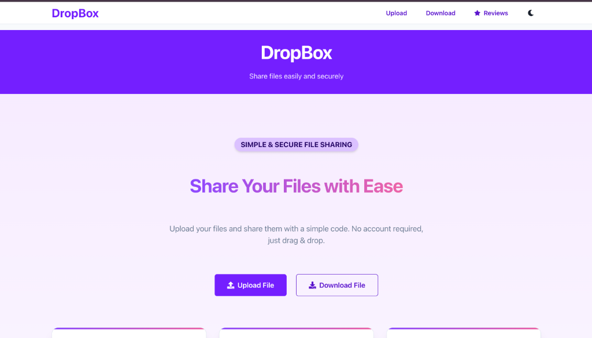
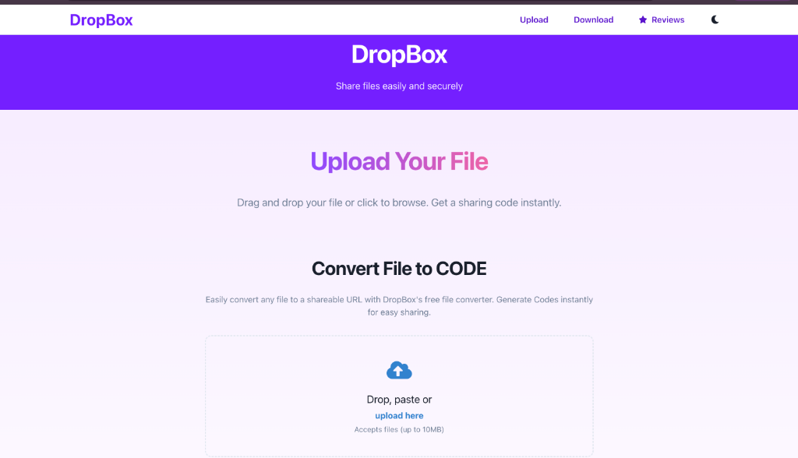
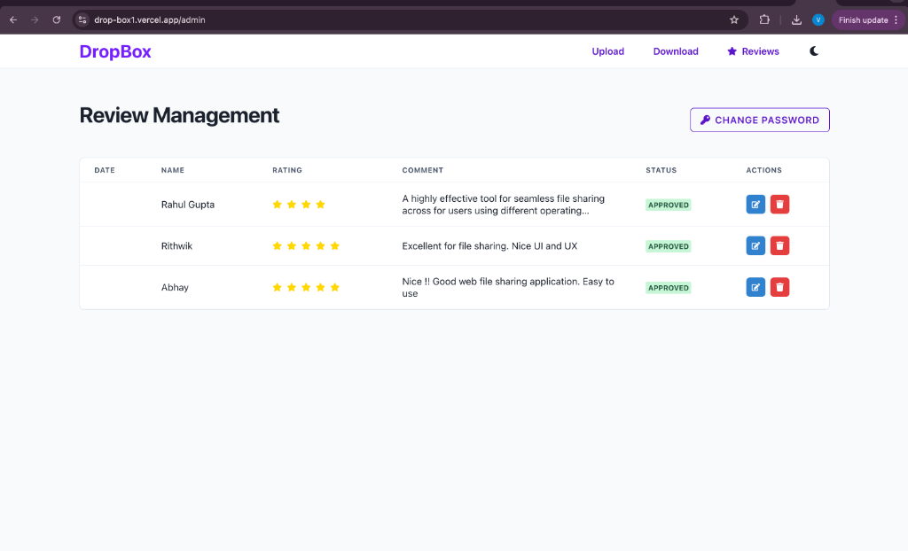

# 📦 DropBox - Simple & Secure File Sharing

A modern file sharing platform that lets you upload files and share them with a simple code. No account required - just drag & drop!


## 📸 Screenshots

<p align="center">
  
</p>

<p align="center">
  <em>🏠 Home Page - Clean and modern landing page</em>
</p>

<p align="center">
  
</p>

<p align="center">
  <em>📤 Upload Page - Drag & drop file upload interface</em>
</p>

<p align="center">
  
</p>

<p align="center">
  <em>👨‍💼 Admin Panel - Review management dashboard</em>
</p>

## ✨ Features

- **⚡ Lightning Fast** - Upload and share files in seconds
- **🔒 Secure** - Files are protected with enterprise-grade security
- **📱 Responsive** - Works seamlessly on desktop and mobile
- **🌙 Dark Mode** - Automatic system color mode support
- **📝 Reviews** - Built-in review system for feedback
- **🔑 Code-Based Sharing** - Share files using unique download codes

## 🚀 Quick Start

### Prerequisites

- Node.js (v18 or higher recommended)
- npm or yarn
- Supabase account (for backend services)

### Installation

1. **Clone the repository**
   ```bash
   git clone https://github.com/yourusername/dropbox.git
   cd dropbox
   ```

2. **Install dependencies**
   ```bash
   npm install
   ```

3. **Configure environment variables**
   
   Copy the example environment file and fill in your credentials:
   ```bash
   cp .env.example .env
   ```
   
   Update `.env` with your Firebase/Supabase credentials:
   ```env
   VITE_FIREBASE_API_KEY=your-api-key
   VITE_FIREBASE_AUTH_DOMAIN=your-auth-domain
   VITE_FIREBASE_PROJECT_ID=your-project-id
   VITE_FIREBASE_STORAGE_BUCKET=your-storage-bucket
   VITE_FIREBASE_MESSAGING_SENDER_ID=your-sender-id
   VITE_FIREBASE_APP_ID=your-app-id
   VITE_FIREBASE_MEASUREMENT_ID=your-measurement-id
   ```

4. **Start the development server**
   ```bash
   npm run dev
   ```

5. **Open your browser** at `http://localhost:5173`

## 📁 Project Structure

```
dropbox/
├── public/              # Static assets
├── src/
│   ├── assets/          # Images and media
│   ├── components/      # Reusable UI components
│   │   ├── FileUpload.jsx
│   │   ├── Layout.jsx
│   │   ├── Header.jsx
│   │   └── Navbar.jsx
│   ├── context/         # React context providers
│   │   └── ReviewContext.jsx
│   ├── pages/           # Page components
│   │   ├── Home.jsx     # Landing page
│   │   ├── Upload.jsx   # File upload page
│   │   ├── Download.jsx # File download page
│   │   ├── Review.jsx   # Reviews page
│   │   └── Admin.jsx    # Admin dashboard
│   ├── services/        # API services
│   │   └── supabase.js  # Supabase client
│   ├── utils/           # Utility functions
│   ├── App.jsx          # Main app component
│   └── main.jsx         # Entry point
├── .env.example         # Environment template
├── index.html           # HTML entry
├── vite.config.js       # Vite configuration
└── vercel.json          # Vercel deployment config
```

## 🛠️ Available Scripts

| Command | Description |
|---------|-------------|
| `npm run dev` | Start development server |
| `npm run build` | Build for production |
| `npm run preview` | Preview production build |

## 🎨 Tech Stack

- **Frontend Framework**: [React 18](https://react.dev/)
- **Build Tool**: [Vite](https://vitejs.dev/)
- **UI Library**: [Chakra UI](https://chakra-ui.com/)
- **Animations**: [Framer Motion](https://www.framer.com/motion/)
- **Routing**: [React Router v6](https://reactrouter.com/)
- **Backend**: [Supabase](https://supabase.com/)
- **Icons**: [React Icons](https://react-icons.github.io/react-icons/)

## 🚢 Deployment

This project is configured for deployment on Vercel. Simply connect your GitHub repository to Vercel and it will automatically deploy on push.

### Manual Deployment

```bash
npm run build
```

The build output will be in the `dist/` directory, ready to be deployed to any static hosting service.

## 📄 License

This project is open source and available under the [MIT License](LICENSE).

## 🤝 Contributing

Contributions, issues, and feature requests are welcome! Feel free to check the issues page.

---

<p align="center">Made with ❤️ using React + Vite</p>
